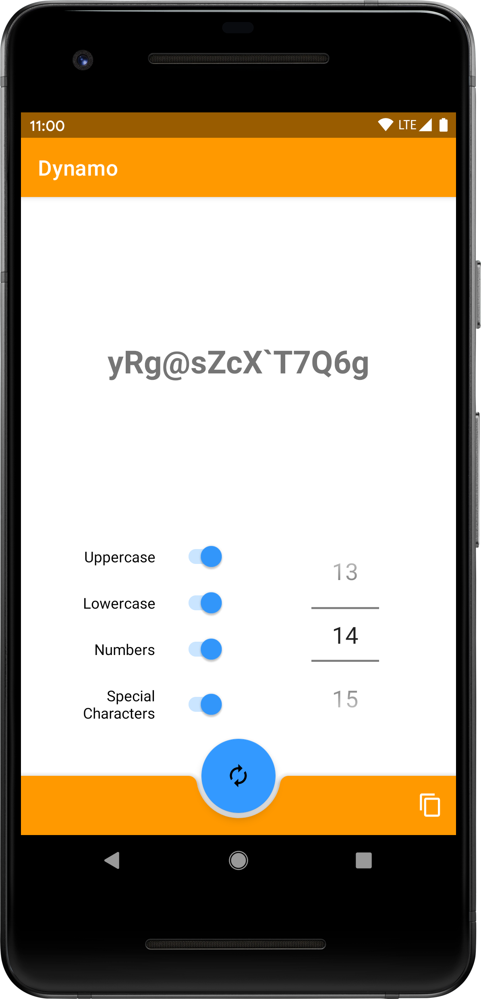

# Dynamo - Password Generator
Password Generator built using [Kotlin Multiplatform](https://kotlinlang.org/docs/reference/multiplatform.html)

## What is this?
Example of using Kotlin Multiplatform to build a password generator library which can be shared across platforms.

Includes example implementations for:
- Android
- iOS

## Experimental ⚠️
This was a hack days project, so expect bugs.